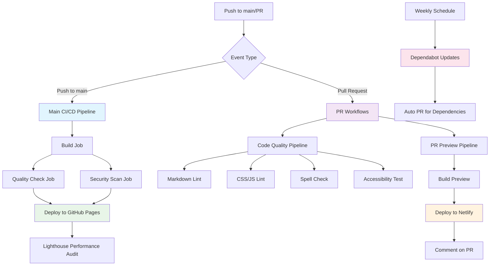

# CI/CD Pipeline Flow Diagram



## Pipeline Stages Breakdown

### 🏗️ Build Stage
1. **Checkout Code** - Get latest repository state
2. **Setup Ruby** - Install Ruby 3.1 with bundle caching
3. **Cache Dependencies** - Restore/save gem cache
4. **Install Dependencies** - Bundle install with parallel jobs
5. **Configure Pages** - Set up GitHub Pages deployment
6. **Build Jekyll** - Generate static site with production config
7. **Upload Artifact** - Store built site for deployment

### 🔍 Quality Stage (Parallel)
1. **HTML Validation** - HTMLProofer checks markup
2. **Link Testing** - Validate internal links and images
3. **Image Optimization** - Check image formats and sizes
4. **Markdown Linting** - Documentation style consistency
5. **CSS/JS Linting** - Code quality standards
6. **Spell Checking** - Content accuracy validation
7. **Accessibility Testing** - a11y compliance verification

### 🔒 Security Stage (Parallel)
1. **Filesystem Scan** - Trivy vulnerability detection
2. **Dependency Analysis** - Check for known CVEs
3. **SARIF Generation** - Security report formatting
4. **GitHub Security Upload** - Integrate with Security tab
5. **Secret Scanning** - Prevent credential leaks

### 🚀 Deploy Stage (Production Only)
1. **Environment Setup** - Configure GitHub Pages environment
2. **Artifact Download** - Retrieve built site
3. **Pages Deployment** - Atomic deployment to GitHub Pages
4. **URL Generation** - Provide deployment URL

### 📊 Performance Stage (Post-Deploy)
1. **Site Availability** - Wait for deployment completion
2. **Lighthouse Audit** - Performance, accessibility, SEO testing
3. **Report Generation** - Detailed performance metrics
4. **Threshold Validation** - Check against performance budgets

### 👀 PR Preview Flow
1. **Branch Build** - Build feature branch changes
2. **Preview Deploy** - Deploy to Netlify staging
3. **URL Generation** - Create unique preview URL
4. **PR Comment** - Auto-comment with preview link
5. **Review Integration** - Enable visual review process

## Performance Characteristics

| Stage | Typical Duration | Cache Impact | Parallel |
|-------|------------------|--------------|----------|
| Build | 2-3 minutes | 40-60% faster | No |
| Quality | 1-2 minutes | N/A | Yes |
| Security | 30-60 seconds | N/A | Yes |
| Deploy | 30-60 seconds | N/A | No |
| Lighthouse | 1-2 minutes | N/A | No |
| **Total** | **3-5 minutes** | **Overall 30% faster** | **Mixed** |

## Trigger Conditions

```yaml
# Main CI/CD Pipeline
on:
  push:
    branches: [main, master]    # Production deployments
  pull_request:
    branches: [main, master]    # PR validation
  workflow_dispatch:            # Manual execution

# Code Quality Pipeline  
on:
  push:
    branches: [main, master]    # Post-merge quality check
  pull_request:
    branches: [main, master]    # PR quality gate

# PR Preview Pipeline
on:
  pull_request:
    types: [opened, synchronize, reopened]  # PR events only
```

## Success Criteria

✅ **All workflows must pass** for merge to main/master  
✅ **Security scans** must show no high-severity vulnerabilities  
✅ **Performance budgets** must meet Lighthouse thresholds  
✅ **Quality gates** must pass all linting and validation  
✅ **Accessibility scores** must meet 90%+ requirement  

The pipeline ensures consistent quality, security, and performance across all changes to the portfolio website.